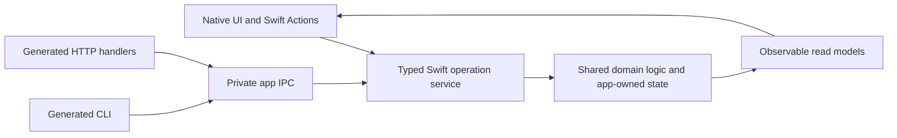

# Keeping the UI, CLI, and HTTP API consistent

Use this method for any app with native UI and an automation interface. The app's
domain might be a media library, editor, timer, or database; the structure stays
the same. Capability parity means that automation can perform and inspect the
same meaningful work, with the same validation and effects. It does not require
matching screen layouts, interaction sequences, or human-readable output.

## One contract and one implementation of behavior

`API/openapi.yaml` defines the public operations, inputs, outputs, errors, routes,
CLI bindings, destructive intent, and capability requirements. Generation produces
the CLI commands, HTTP handlers, DTOs, dispatch, discovery, and required Swift
service protocols. Implement those protocols in Swift. Keep business rules,
transactions, conflict handling, and platform behavior in shared Swift services.

SwiftUI remains handwritten and calls those services directly, optionally through
a small native Swift adapter. The UI does not need to send HTTP requests to its
own app. Pure Swift also handles custom CLI parsing, rendering, or workflows.
The spec contains interface declarations; it does not become a behavior language.

On macOS, the running app owns mutable domain state. The bundled CLI starts the
HTTP listener with `serve`; both automation interfaces reach the app through
private IPC. Validated TOML configuration is the deliberate exception: the UI and
CLI can call its common Swift service locally. For a native iPhone companion,
compile the same domain services into its core and inject the appropriate platform
adapters. Cross-device persistence synchronization is a separate concern.

## Define capabilities from user outcomes

Design operations around meaningful actions and inspectable state. One UI flow can
use several operations, and several controls can call the same operation. For
example, a context menu and an inspector can both call `itemRename`.

| Feature | Shared contract and behavior | UI responsibility |
| --- | --- | --- |
| Rename a library item | `itemRename`: ID, new name, optional expected revision; validate and return the updated item | Collect input and display the result or conflict |
| Browse and filter items | `itemList` / `itemGet`: inspectable fields and shared filter semantics; paginate large results | Selection, layout, scrolling, and formatting |
| Remove an item | `itemRemove`: shared deletion rules and explicit destructive confirmation | Present confirmation, then invoke the operation |
| Export content | `itemExport`: shared format and export logic, using the bounded transfer mechanism | Choose a destination and show progress |
| Run a long operation | Start/status/cancel operations over one shared job state machine | Observe progress and expose cancellation |
| Change a persisted preference | The validated configuration service | Bind a native control to that service |

These names illustrate the pattern; choose names and operations for the actual app.
Transient presentation state such as a selected tab, an open sheet, or an unsaved
draft can stay local. Persisted content, configuration, computed domain results,
and device actions need an automation representation. Infrastructure commands such
as starting the HTTP listener need not have a matching UI button.

## Keep the Swift boundary explicit

Keep domain code in `Sources/Shared`, Mac adapters in `Sources/Core`, and views in
the platform UI targets. Persistence mutation methods and raw storage handles stay
internal to the core module. Expose immutable snapshots or observable read models
to views, rather than a database context or publicly writable domain objects.

For every exposed store `ItemStore`, define and conform to `ItemStoreReadAccess`.
Its members describe the allowed read surface. The declaration check uses this
naming convention to reject added public members outside that surface and public
setters. Register new stores this way as features are added; declaring an unrelated
public type does not automatically enroll it in the check. Keep mutation methods
out of the read protocol.

Native adapters named `*Actions` may prepare generated inputs, map results into
native values, or compose operations. Their public methods must delegate to
generated operations, as checked by `scripts/check-ui-boundary.py`. Put validation
and writes in the service, so every caller gets the same behavior. If a workflow
must be atomic, give it one service transaction and an operation; composing several
committed mutations requires explicit partial-completion behavior.

The UI observes the same app-owned state that the service updates. An operation
performed through CLI or HTTP must invalidate or refresh the UI's read models just
as a native action does. Sharing a method without sharing state ownership and
change notifications would still allow the interfaces to diverge.

Device adapters implement window, microphone, notification, or other platform
actions. They share capability/status and error semantics, including a clear
unavailable result where support or permission is absent. Native permission prompts
remain app-owned. Use deterministic injected adapters for automated tests and
verify real device behavior separately when the adapter changes.

## Add a feature through all three interfaces

1. Define the capability's inputs, observable results, and failure behavior. Add
   its OpenAPI operations and `x-cli` bindings, then run `scripts/generate-api.sh`.
2. Implement the generated Swift requirement using the shared domain service.
   Preserve omitted versus cleared values, conflict preconditions, and destructive
   intent. Add domain tests for behavior that warrants them.
3. Connect native UI actions to that service and its read models. Add a focused
   adapter or view-model test that invokes the action and checks its arguments and
   observable result. Include a test of read-model refresh after an external service
   write when the UI caches state. Use UI tests for interaction-specific risks.
4. Add optional CLI customization under `Sources/CLI/Custom`. Call the typed client
   and retain shared validation, errors, and the `--json` envelope. Keep generated
   routes and commands in the generated catalog.
5. Add typed `ScenarioStep` cases in `TestsSupport/AppScenarios.swift`. Assert
   meaningful returned values and subsequent state; include relevant invalid input,
   conflict, null/clear, destructive, and capability cases. A rename example should
   rename an isolated item and then read it back with the new name.
6. Run `scripts/verify.sh`. Commit the spec, generated files, manifest, package
   locks, service/UI changes, and scenarios together. Document actual capability
   limitations and the verification still needed on a real device.

The Swift scenario suite executes the same inputs and assertions through direct
typed calls, the real CLI, and the real HTTP listener, each with isolated state.
It requires exact operation-ID coverage before execution and after assertions pass.
Adding a spec operation without a scenario fails verification. An expected error
case checks its error code; an empty success assertion is not meaningful behavior
coverage even though it can satisfy the operation-ID count. Test ordinary success
where supported, and label device-unavailable cases as testing that failure path.

## Enforce the process with executable checks

`scripts/verify.sh` is the common local and CI entry point. It verifies generated
output and dependency locks, checks Swift declaration boundaries, proves selected
forbidden calls fail compilation, runs negative gate tests and domain/runtime
tests, executes all transport scenarios, and builds the platform targets. Extend
the compiler probes for new domain stores. The scaffold initially probes its
configuration store; it cannot know the names of future domain types.

The `App verification` GitHub Actions job runs the same script. Configure the
repository's required check with `python3 scripts/require-verification.py --apply`
and inspect it with the same command without `--apply`. Match the workflow's push
branch to the repository's default branch. A hosting-plan or permission failure
must be reported: a workflow file alone does not enforce merging. These pass/fail
decisions come from programs and test assertions, with no LLM evaluation step.

The checks enforce declared structure and tested behavior. They cannot infer that
an entirely new UI feature should have an operation, decide whether an assertion
is useful, or prove that every button calls the intended action. Defining the
capability and adding meaningful UI/service assertions are part of implementation;
the executable gate then verifies those assertions on subsequent changes.
